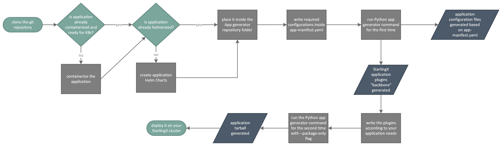
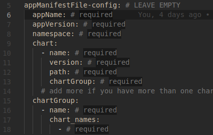
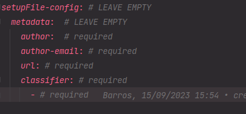

# StarlingX Application Generation Tool

The purpose of this tool is to generate a StarlingX App from a workload/app
in an easy way without the complete StarlingX build environment.

## TODO list

- [ ] Remove the need for `appManifestFile-config.chartGroup.chart_names` in `app_manifest.yaml` since it can be
inferred by `appManifestFile-config.chart.name[]`.
  - [ ] Also remove the redundant chartGroup in the process.
- [ ] Test what happens if we have a Helm chart that has a fixed container image instead of an overridable one.
- [ ] Explain better why our generated system overrides is empty.

## Why deploy an application as a StarlingX application?

It's important to understand that any user workload can be deployed in many
ways to the Kubernetes cluster(s) that StarlingX manages:

- with the most common Kubernetes package manager, [Helm](https://helm.sh/);
- with [Flux](https://fluxcd.io/), to enjoy all the benefits that come with it
; and finally
- as a StarlingX Application, which benefits from tight integration with the
  [StarlingX system](https://opendev.org/starlingx/config).

## Pre-requisite

- Helm version 2+
- Python version 3.8+
- `pyyaml` version 6.0+
  - `$ pip3 install pyyaml==6.0.1`

## General Overview



## 3 Steps to create a Starlingx App

### 1. Prepare Helm chart(s)

#### What is Helm and a Helm chart?

Helm is a Kubernetes package and operations manager. A Helm chart can contain
any number of Kubernetes objects, all of which are deployed as part of the
chart.

The official place to find available Helm Charts is: https://artifacthub.io/.

#### How to develop a Helm chart?

Refer to official [helm doc](https://helm.sh/docs/)

### 2. Create an app manifest

A few essential fields are needed to create the app. The simplest
example is:

```yaml
appManifestFile-config:
  appName: stx-app
  appVersion: 1.0.1
  namespace: default
  chart:
    - name: chart1
      version: 1.0.1
      path: /path/to/chart1
      chartGroup: chartgroup1
  chartGroup:
    - name: chartgroup1
      chart_names:
        - chart1

setupFile-config:
  metadata: 
      author: John Doe
      author-email: john.doe@email.com
      url: johndoe.com
      classifier: # required
        - "Operating System :: OS Independent"
        - "License :: OSI Approved :: MIT License"
        - "Programming Language :: Python :: 3"
```

#### 3. Run the StarlingX App Generator

```shell
python3 app-gen.py -i app_manifest.yaml [-o ./output] [--overwrite] [--no-package]|[--package-only]
```

Where:

- `-i/--input`: path to the `app_manifest.yaml` configuration file.
- `-o/--output`: output folder. Defaults to a new folder with the app name in
  the current directory.
- `--overwrite`: deletes existing output folder before starting.
- `--no-package`: only creates the FluxCD manifest, plugins and the
  metadata file, without compressing them in a tarball.
- `--package-only`: create the plugins wheels, sha256 file, helm-chart tarball
  and package the entire application into a tarball.

Below you will find detailed instructions on how to use this repo to create
a StarlingX App package from your own code.

# Deploy an application as a StarlingX app

This guide describes the steps to deploy an application as a **StarlingX App**
utilizing the StarlingX's App Generator tool.

If you want to learn more about the app generator tool, please visit
https://github.com/Danmcaires/StarlingX-App-Generator (this is a temporary
repository, all relevant info/code, if any, will be moved to official
repositories by the end of this study).

* [Deploy an application as a StarlingX app](#deploy-an-application-as-a-starlingx-app)
  * [Prerequisites](#prerequisites)
  * [Generate the StarlingX Application package](#generate-the-starlingx-application-package)
    * [App manifest configuration](#app-manifest-configuration)
    * [Metadata File Configuration](#metadata-file-configuration)
    * [App Setup configuration](#app-setup-configuration)
  * [Run the StarlingX App Generator](#run-the-starlingx-app-generator)
    * [FluxCD Manifest](#fluxcd-manifest)
    * [Plugins](#plugins)
    * [Metadata](#metadata)
    * [Tarballs](#tarballs)
  * [Customizing the application](#customizing-the-application)
    * [FluxCD Manifest](#fluxcd-manifest-1)
    * [Plugins](#plugins-1)
    * [Other files](#other-files)

## Prerequisites

As the StarlingX Platform manages a distributed Kubernetes cluster, for an
application to be deployed as a StarlingX App it needs to be designed so it can
run on [Kubernetes](https://kubernetes.io/).

Additionally, it needs to provide a [Helm Chart](https://helm.sh/)
which will be managed via [Flux](https://fluxcd.io/) by StarlingX itself.

## Generate the StarlingX Application package

Clone the app-generator repository.
```shell
git clone https://github.com/Danmcaires/StarlingX-App-Generator.git
```

This is what you'll find in the root folder of the repository:

```shell
.
├── app-gen.py
├── app_manifest.yaml
├── README
│   ├── app-gen-tool.jpeg
│   ├── app-manifest-config-empty.png
│   └── setup-cfg.png
├── README.md
├── templates_flux
│   ├── base
│   ├── fluxcd-manifest
│   └── kustomization.template
└── templates_plugins
    ├── common.template
    ├── helm.template
    ├── kustomize.template
    └── lifecycle.template
```

The `app_manifest.yaml` is the most important configuration step since it
specifies everything necessary to build the StarlingX application.

The app manifest configuration can be divided into three parts, which will
have their own dedicated section below:

- [App manifest configuration](#app-manifest-configuration)
- [Metadata file configuration](#metadata-file-configuration)
- [App Setup Configuration](#app-setup-configuration)

### App manifest configuration

In this stage the section **appManifestFile-config** from the
`app_manifest.yaml` will be configured.



These are the minimum required fields that will need to be filled in order
for the StarlingX App Generator to work properly.

Below you will find a brief explanation of every one of the required fields
which will help you fill them out for you application:

- **appName** field: desired StarlingX application name, referenced throughout
  the whole system.
- **appVersion** field: the version of the application that the generated
  package will represent.
- **namespace** field: desired StarlingX application namespace (note that this
  namespace is not the same as the Kubernetes namespace).
- **chart** section: an array with an object for every Helm chart in your
  application. Each object contains:
  - **name** field: your Helm chart name as it is in the chart metadata.
  - **version** field: your chart version as it is in the chart metadata.
  - **path** field: relative path to the Helm chart directory, Helm repo or
    Helm package file.
  > _NOTE_: Currently only Helm charts in directories have been tested.
  - **chartGroup** field: default is _application-name-charts_.
- **chartGroup** section:
  - **name**: only one chart group per application.
  - **chart_names**: a list of the names of the charts from your application.

### Metadata File Configuration

In this stage the section **metadataFile-config** from the
`app_manifest.yaml` will be configured.

This section's objective is to configure the generation/creation of a
`metadata.yaml` file, which is the core metadata file for a StarlingX App
package.

This `metadata.yaml` file is very flexible, hence the **metadataFile-config**
section is also very flexible. Other values may be passed in order to enable
advanced features within the StarlingX platform. For a better understanding of
each attribute in this section please refer to
[this link](https://wiki.openstack.org/wiki/StarlingX/Containers/StarlingXAppsInternals#metadata.yaml).

### App Setup configuration

In this stage the section **setupFile-config** from the `app_manifest.yaml`
will be configured.

Below you will find a brief explanation of every one of the required fields
which will help you fill them out for you application:



- **metadata** section:
  - **author/author-email/url fields**: authorship information.
  - **classifier** section: an array of additional information.

This section is related to the `setup-cfg` file that will be generated. For
more advanced use cases you may want to refer to [the documentation](https://setuptools.pypa.io/en/latest/userguide/declarative_config.html).

## Run the StarlingX App Generator

```shell
python3 app-gen.py -i app_manifest.yaml
```

With the command above, the StarlingX App Generator will create a set of files
and package everything in the StarlingX format.

The following sections explain in high-level the most important parts of the
package.

### FluxCD Manifest

The generator will first create the FluxCD Manifest following the structure below:

```shell
fluxcd-manifests/
├── base
│   ├── helmrepository.yaml
│   ├── kustomization.yaml
│   └── namespace.yaml
├── kustomization.yaml
└── CHART-NAME
    ├── helmrelease.yaml
    ├── kustomization.yaml
    ├── CHART-NAME-static-overrides.yaml
    └── CHART-NAME-system-overrides.yaml
```

For every Helm chart configured in the `app_manifest.yaml` file, a folder with
the name of the chart will be created.

> **_NOTE_**: The `CHART-NAME-static-overrides.yaml` file will be empty.

### Plugins

After the creation of the FluxCD Manifest, the generator will also create a set
of plugins with an empty implementation.

The Structure of the plugins created will be:

```shell
plugins/
├── k8sapp_APP_NAME
│   ├── common
│   │   ├── __init__.py
│   │   └── constants.py
│   ├── helm
│   │   ├── __init__.py
│   │   └── CHART_NAME.py
│   ├── kustomize
│   │   ├── __init__.py
│   │   └── kustomize_APP_NAME.py
│   └── lifecycle
│       ├── __init__.py
│       └── lifecycle_APP_NAME.py
├── __init__.py
├── setup.cfg
└── setup.py
```

The `setup.cfg` file will be created according to the
[`setupFile-config`](#app-setup-configuration) section in the `app_manifest.yaml`.

### Metadata

In the third step of the execution the `metadata.yaml` file will be generated
with the information given in [`metadataFile-config`](#metadata-file-configuration)
section in the `app_manifest.yaml`.

### Tarballs

After the main files have been created, the generator will start packaging
everything.

Firstly it will package every helm-chart, that was given in the
`app_manifest.yaml` file, into a `.tgz` file, saving these files into a folder
named `charts`.

The generator, then, will package the plugins with the [wheel](https://peps.python.org/pep-0491/)
format.

Lastly, creates a checksum sha256 signature file for the output tarball and
the output tarball itself, which will be called

```
<APPNAME>-<APPVERSION>.tgz
```

The structure of the app inside the tarball will be the following:

```shell
 APPNAME-APPVERSION.tgz/
 ├── charts/
 ├── fluxcd-manifests/
 ├── plugins/
 ├── checksum.sha256
 └── metadata.yaml
```

> **Warning:**
> At this point, the generated package is a working StarlingX App, however it
> contains empty templates for some files. The following sections will describe
> how to further enhance your StarlingX App.

## Customizing the application

If you wish to customize Flux and the plugins for the particularities of
your application, it is important to modify some of the generated files.

In order to allow such customization, the generator provides additional
functions to modify specific files in the package.

```shell
python3 app-gen.py -i app_manifest.yaml [-o ./output] [--overwrite] [--no-package]|[--package-only]
```

Where:

- `-i/--input`: path to the `app_manifest.yaml` configuration file.
- `-o/--output`: output folder. Defaults to a new folder with the app name in
  the current directory.
- `--overwrite`: deletes existing output folder before starting.
- `--no-package`: only creates the FluxCD manifest, plugins and the
  metadata file, without compressing them in a tarball.
- `--package-only`: create the plugins wheels, sha256 file, helm-chart tarball
  and package the entire application into a tarball.

This means that, in order to be able to make additional configuration, one must:

- first run the App Generator with `--no-package`;
- then do the changes (described in the following sections);
- finally, run the App Generator again with `--package-only`.

### FluxCD Manifest

> _NOTE_: this section needs improvement.

Most of the generated manifest won't need any modification, but for every
Helm chart in the `app_manifest.yaml`, a static-overrides file will be created.
The static-overrides file contains all information that is not to be
overwritten inside the values.yaml of the Helm chart.

### Plugins

The StarlingX App Generator will create 3 main plugins: the Helm,
the Kustomize and the Lifecycle plugins.

- The `helm/APP_NAME.py` file is responsible for the overriding methods that will
  be used to create the Helm overrides for the StarlingX App.

- The `kustomize_APP_NAME.py` is a plugin that is used to make changes to the
  top-level `kustomization` resource list based on the platform mode.

- The `lifecycle_APP_NAME.py` is responsible for performing lifecycle actions on the
  application using the lifecycle hooks of the StarlingX Platform.

The files created by the generator will have an empty implementation and is up
to the developer to implement everything that is necessary for the application
to run as intended.

The `sysinv` folder in the [StarlingX config repository](https://opendev.org/starlingx/config/src/branch/master/sysinv/sysinv/sysinv/sysinv)
contains a multitude of functions and variables that may be helpful in the
development of application plugins.

### Other files

For the customization of the application the modifications above, in the FluxCD
and the plugins, should be enough for the application to run as expected in the
StarlingX platform.

With that in mind, it is recommended to check if the `metadata` and the `setup.cfg`
have been created as they should. Particularly, the `setup.cfg` may need careful
attention if the modifications on the plugin file should be reflected in it.
